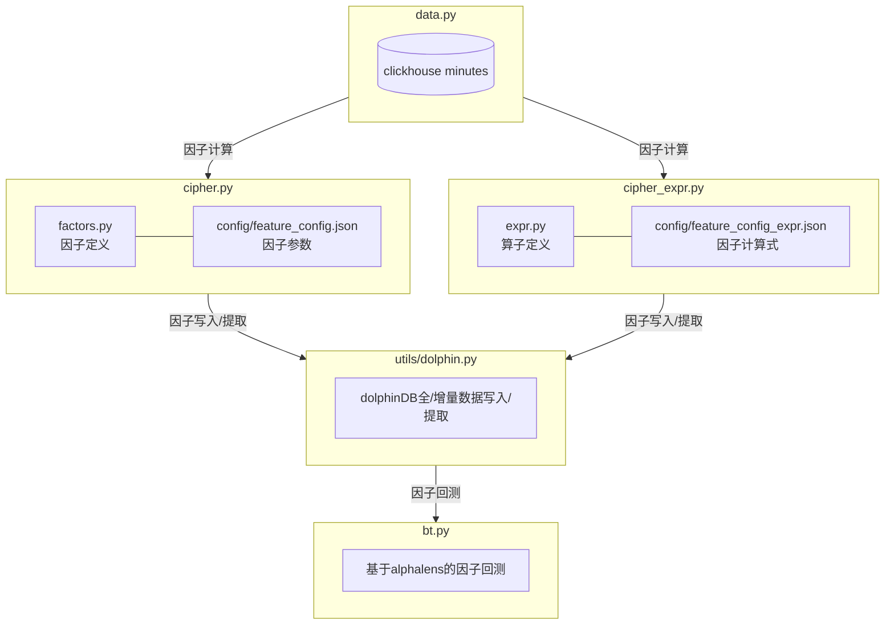

# 分钟级因子生成框架



---

### 数据源

`clickhouse` 分钟级数据

| date | code | open | high | low | close | volume | amount | avg |
|-------|-------|-------|-------|-------|-------|-------|-------|-------|
|2020-01-02 09:31:00|000001.SZ|16.65|16.74|16.65|16.7|8442000|140781646|16.68|


### 数据整理

📦 `data.py`

使用 `StockData` 类，整理分钟级数据，按照不同模式**设置日期**并**计算收益率**

❓为何要重新设置日期❓鉴于不同模式，因子计算的时间点不同，因此需要重新设置日期(`date`)，例如模式2，要用当日9:31-当日14:50的数据计算因子，然后用当日14:55-次日9:31的数据计算收益率，方便利用 `date code` 进行 `groupby`

**i) 当日9:31-当日15:00的数据作为一个date，pat_ret对应次日9:31-次日15:00的收益率，即根据今日9:31-15:00数据计算因子，次日9:31建仓，次日15:00平仓**

**ii) 当日9:31-当日14:50的数据作为一个date，pat_ret对应今日14:55-次日9:31的收益率，即根据今日9:31-14:50数据计算因子，今日14:55建仓，次日9:31平仓**

**iii) 昨日13:01-当日11:30的数据作为一个date，pat_ret对应今日13:01-次日11:30的收益率，即根据昨日13:01-今日11:30数据计算因子，今日13:01建仓，次日11:30平仓**

| pattern | date | pat_ret | position |
|-------|-------|-------|-------|
|i|当日9:31-当日15:00|次日9:31-次日15:00|date内数据计算因子pat_ret建仓|
|ii|当日9:31-当日14:50|当日14:55-次日9:31|date内数据计算因子pat_ret建仓|
|iii|昨日13:01-当日11:30|今日13:01-次日11:30|date内数据计算因子pat_ret建仓|
								
### 因子计算（原版）

📈 `factors.py` 因子定义在 `B_feature` 类中

📈 `config/feature_config.json` 因子参数

📈 `cipher.py` 因子计算

> 计算逻辑：根据 `date code` 进行 `groupby`，然后相同 `date` 的日内分钟级数据计算因子，目前为加快效率使用双进程

```python
def cal_feature(self):
    print("[+] start calculating factors...")
    with Pool(processes=self.pool_num) as pool:
        result_list = pool.map(self.loop_cal_factors, [group for _, group in self.StockData.data.groupby(['code', 'date'])])
    print("[+] finish calculating factors")
    return pd.concat(result_list, axis=0).reset_index()
```

### 因子计算（改版）

📈 `expr.py` 算子定义

📈 `config/feature_config_expr.json` 因子计算式

📈 `cipher_expr.py` 因子计算

这样做的目的是为了

> 1. 更好的管理因子计算式，方便新增因子，方便因子计算式的修改
>
> 2. 接轨目前业界最流行挖因子思路，参考 [`alphagen`](https://github.com/RL-MLDM/alphagen)、[`Alpha-GPT`](https://arxiv.org/pdf/2308.00016.pdf) 


### 因子写入/提取

🐬 `utils/dolphin.py` dolphinDB全/增量数据写入/提取

由于 `dolphin` 目前没有新增一列且操作方便的 `pythonAPI`，所以当导入新因子时，采用读取全部数据、使用 `python` 语法将全部数据与新因子合并、再全量写入的方法

```python
# 全部数据
factor_before = get_data_from_dolphindb(factors_dbPath, factors_tableName, start_date, end_date, columns='*')
# 新因子
factor_new = factor_all[['code', 'date', 'vol_downVol']]
# 合并后全量写入
factor_all_new = pd.merge(factor_before, factor_new, on=['code', 'date'], how='inner')
to_dolphindb_all(factor_all_new, factors_dbPath, factors_tableName)
```


### 因子回测(待完善，参考 `report/因子检测框架.pdf `)

📊 `bt.py`

借助 `alphalens` 进行因子回测，主要参数如下

| 参数 | 类型 | 说明 |
|-------|-------|-------|
|factor_data|pd.DataFrame|因子数据，date时间，code代码，columns为因子值|
|periods|Union[int, Tuple[int]]|收益计算的时间周期，可以为单个整数或者整数的元组，传入prices时参与计算，传入returns时不参与计算|
|n_quantiles|int|分位数数量，每个时间节点等量分为n_quantiles组|
|prices|pd.DataFrame|价格数据，与periods结合计算收益率，date时间，code代码，prices_colunm为列名，与returns二选一|
|prices_colunm|str|价格数据的列名|
|returns|pd.DataFrame|收益数据，直接传入收益率，默认period为1，date时间，code代码，returns_colunm为列名，与prices二选一|
|returns_colunm|str|收益数据的列名|
|long_short|bool|是否计算多空组合收益，True会去除market影响，适合比较不同组的收益，False会计算每组的绝对收益|
|instructors|Union[str, Tuple[str]]|因子分析选项，可选'statistic' 'return' 'ic' 'turnover' 'all'，可选择其中一项或者多项|

- `def preprocess | def combine_data`： 将 `factors` 和 `prices / returns` 处理成 `alphalens` 所需的格式

| index(date) | index(asset) | 1D | 5D | factor | factor_quantile |
|-------|-------|-------|-------|-------|-------|
|2018-01-02|000001.SZ|-0.027007|-0.045255|0.18|3|
|2018-01-02|000002.SZ|-0.007064|0.1007372|0.63|4|
|...|...|...|...|...|...|
|2018-01-03|000001.SZ|-0.034366|-0.022178|0.20|2|

- `def overall_description`：单因子总体描述（收益率、换手率、IC）

| index(year) | lret | sret | lsret | sharp | win | ltvr | stvr | lstvr | allic | lic | sic | lsic | tdays |
|-------|-------|-------|-------|-------|-------|-------|-------|-------|-------|-------|-------|-------|-------|
|2018|9.99%|-11.58%|21.57%|2.605211|0.6534|0.5927|0.5316|1.1243|0.0255|0.0093|0.0181|0.0181|243|
|2019|28.67%|-49.81%|78.48%|12.65662|0.8074|0.5702|0.5059|1.0761|0.0481|-0.0029|0.0608|0.0608|244|
|...|...|...|...|...|...|...|...|...|...|...|...|...|...|...|
|period|19.90%|-34.37%|54.26%|6.417944|0.7084|0.5717|0.5107|1.0824|0.0325|0.0003|0.0414|0.0414|1437|

- `def statistic_analysis`： 单因子描述性统计

- `def return_analysis`： 单因子收益分析

- `def ic_analysis`： 单因子IC分析

- `def turnover_analysis`： 单因子换手率分析

### TODO

> 🆕 因子数据库存量增量写入 ✅
>
> 🆕 因子回测的结果展示，重写 `alphalens` 方法，实现换仓频率>1天的分层累计收益图 ✅
>
> 🆕 因子回测的结果展示，定制化 ⏭️
>
> 🆕 完善因子数量
>
> 🆕 除 `B_feature` 外的其他因子适配